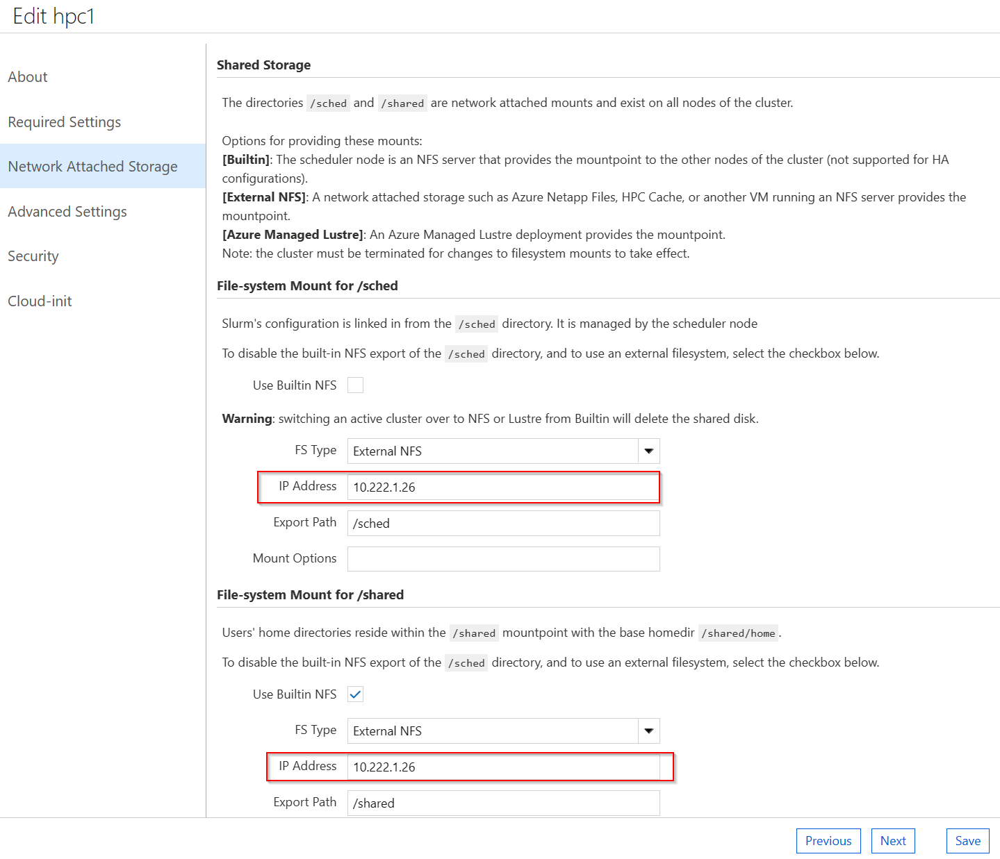
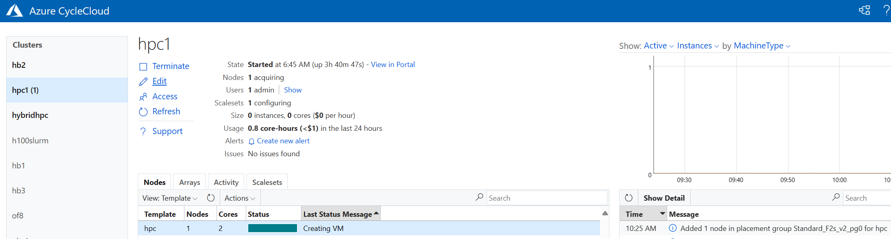

# Slurm Cloud Bursting Using CycleCloud

This repository provides detailed instructions and scripts for setting up Slurm bursting using CycleCloud on Microsoft Azure, allowing you to seamlessly scale your Slurm cluster into the cloud for additional compute resources.

## Overview

Slurm bursting enables the extension of your on-premises Slurm cluster into Azure for flexible and scalable compute capacity. CycleCloud simplifies the management and provisioning of cloud resources, bridging your local infrastructure with cloud environments.

## Table of Contents

- [Requirements](#requirements)
- [Setup Instructions](#setup-instructions)
- [Importing a Cluster Using the Slurm Headless Template in CycleCloud](#importing-a-cluster-using-the-slurm-headless-template-in-cyclecloud)
- [Slurm Scheduler Installation and Configuration](#slurm-scheduler-installation-and-configuration)
- [CycleCloud UI Configuration](#cyclecloud-ui-configuration)
- [CycleCloud Autoscaler Integration with Slurm Scheduler](#cyclecloud-autoscaler-integration-on-slurm-scheduler)
- [User and Group Setup (Optional)](#user-and-group-setup-optional)
- [Testing the Setup](#testing-the-setup)
- [Contributing](#contributing)

## Requirements

Ensure you have the following prerequisites in place:

- **OS Version supported**: AlmaLinux release 8.7 (`almalinux:almalinux-hpc:8_7-hpc-gen2:latest`) & Ubuntu HPC 22.04 (`microsoft-dsvm:ubuntu-hpc:2204:latest`)
- **Slurm Version**: 23.11.9-1
- **CycleCloud Version**: 8.6.4-3320

## Setup Instructions

### Importing a Cluster Using the Slurm Headless Template in CycleCloud

- This step must be executed on the **CycleCloud VM**.
- Make sure that the **CycleCloud 8.6.4 VM** is running and accessible via the `cyclecloud` CLI.
- Execute the `cyclecloud-project-build.sh` script and provide the desired cluster name (e.g., `hpc1`). This will set up a custom project based on the `cyclecloud-slurm-3.0.9` version and import the cluster using the Slurm headless template.
- In the example provided, `hpc1` is used as the cluster name. You can choose any cluster name, but be consistent and use the same name throughout the entire setup.


```bash
git clone https://github.com/Azure/cyclecloud-slurm.git
cd cyclecloud-slurm/cloud_bursting/slurm-23.11.9-1/cyclecloud
sh cyclecloud-project-build.sh
```

Output :

```bash
[user1@cc86vm ~]$ cd cyclecloud-slurm/cloud_bursting/slurm-23.11.9-1/cyclecloud
[user1@cc86vm cyclecloud]$ sh cyclecloud-project-build.sh
Enter Cluster Name: hpc1
Cluster Name: hpc1
Use the same cluster name: hpc1 in building the scheduler
Importing Cluster
Importing cluster Slurm_HL and creating cluster hpc1....
----------
hpc1 : off
----------
Resource group:
Cluster nodes:
Total nodes: 0
Locker Name: HPC+AI storage
Fetching CycleCloud project
Uploading CycleCloud project to the locker
```

### Slurm Scheduler Installation and Configuration

- A VM should be deployed using the specified **AlmaLinux 8.7** or **Ubuntu 22.04** image. 
- If you already have a Slurm Scheduler installed, you may skip this step. However, it is recommended to review the script to ensure compatibility with your existing setup.
- Run the Slurm scheduler installation script (`slurm-scheduler-builder.sh`) and provide the cluster name (`hpc1`) when prompted.
- This script will install and configure Slurm Scheduler.


```bash
git clone https://github.com/Azure/cyclecloud-slurm.git
cd cyclecloud-slurm/cloud_bursting/slurm-23.11.9-1/scheduler
sh slurm-scheduler-builder.sh
```
Output 

```bash
------------------------------------------------------------------------------------------------------------------------------
Building Slurm scheduler for cloud bursting with Azure CycleCloud
------------------------------------------------------------------------------------------------------------------------------

Enter Cluster Name: hpc1
------------------------------------------------------------------------------------------------------------------------------

Summary of entered details:
Cluster Name: hpc1
Scheduler Hostname: masternode2
NFSServer IP Address: 10.222.1.26
```

### CycleCloud UI Configuration

- Access the **CycleCloud UI** and navigate to the settings for the `hpc1` cluster.
- Edit the cluster settings to configure the VM SKUs and networking options as needed.
- In the **Network Attached Storage** section, enter the NFS server IP address for the `/sched` and `/shared` mounts.
- Select the OS from Advance setting tab - **Ubuntu 22.04** or **AlmaLinux 8** from the drop down based on the scheduler VM.
- Once all settings are configured, click **Save** and then **Start** the `hpc1` cluster.



### CycleCloud Autoscaler Integration on Slurm Scheduler

- Integrate Slurm with CycleCloud using the `cyclecloud-integrator.sh` script.
- Provide CycleCloud details (username, password, and ip address) when prompted.

```bash
cd cyclecloud-slurm/cloud_bursting/slurm-23.11.9-1/scheduler
sh cyclecloud-integrator.sh
```
Output:

```bash
[root@masternode2 scripts]# sh cyclecloud-integrator.sh
Please enter the CycleCloud details to integrate with the Slurm scheduler

Enter Cluster Name: hpc1
Enter CycleCloud Username: user1
Enter CycleCloud Password:
Enter CycleCloud IP (e.g., 10.222.1.19): 10.222.1.19
------------------------------------------------------------------------------------------------------------------------------

Summary of entered details:
Cluster Name: hpc1
CycleCloud Username: user1
CycleCloud URL: https://10.222.1.19

------------------------------------------------------------------------------------------------------------------------------
```

### User and Group Setup (Optional)

- Ensure consistent user and group IDs across all nodes.
- It is advisable to use a centralized User Management system like LDAP to maintain consistent UID and GID across all nodes.
- In this example, we are using the `useradd_example.sh` script to create a test user `user1` and a group for job submission. (User `user1` already exists in CycleCloud)

```bash
cd cyclecloud-slurm/cloud_bursting/slurm-23.11.9-1/scheduler
sh useradd_example.sh
```

### Testing the Setup

- Log in as a test user (e.g., `user1`) on the Scheduler node.
- Submit a test job to verify that the setup is functioning correctly.

```bash
su - user1
srun hostname &
```
Output:
```bash
[root@masternode2 scripts]# su - user1
Last login: Tue May 14 04:54:51 UTC 2024 on pts/0
[user1@masternode2 ~]$ srun hostname &
[1] 43448
[user1@masternode2 ~]$ squeue
             JOBID PARTITION     NAME     USER ST       TIME  NODES NODELIST(REASON)
                 1       hpc hostname    user1 CF       0:04      1 hpc1-hpc-1
[user1@masternode2 ~]$ hpc1-hpc-1
```


You should see the job running successfully, indicating a successful integration with CycleCloud.

For further details and advanced configurations, refer to the scripts and documentation within this repository.

---

These instructions provide a comprehensive guide for setting up Slurm bursting with CycleCloud on Azure. If you encounter any issues or have questions, please refer to the provided scripts and documentation for troubleshooting steps. Happy bursting!

# Contributing

This project welcomes contributions and suggestions.  Most contributions require you to agree to a
Contributor License Agreement (CLA) declaring that you have the right to, and actually do, grant us
the rights to use your contribution. For details, visit https://cla.microsoft.com.

When you submit a pull request, a CLA-bot will automatically determine whether you need to provide
a CLA and decorate the PR appropriately (e.g., label, comment). Simply follow the instructions
provided by the bot. You will only need to do this once across all repos using our CLA.

This project has adopted the [Microsoft Open Source Code of Conduct](https://opensource.microsoft.com/codeofconduct/).
For more information see the [Code of Conduct FAQ](https://opensource.microsoft.com/codeofconduct/faq/) or
contact [opencode@microsoft.com](mailto:opencode@microsoft.com) with any additional questions or comments.